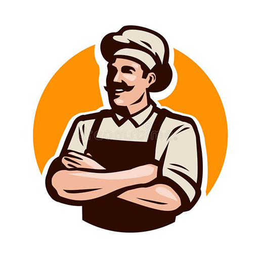
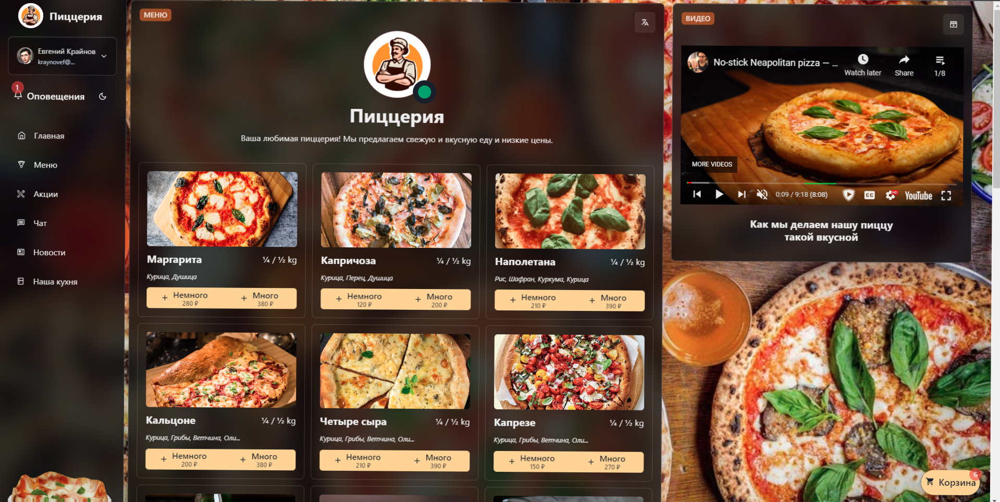

<div align="center">
	<h1><a href="https://restik.vercel.app/">Restik</a></h1>
	

Restik is a restaurant app for ordering dishes and managing customers' orders.

	
	


	


	


	
<h2>Screenshots</h2>

</div>

  
  

## Tech Stack

- Made *fast* with [React](https://reactjs.org/)
- Made *faster* with [Next.js](https://nextjs.org/)
- Made *stylish* with [Chakra UI](https://next.chakra-ui.com/)
- Made *a bit **more** stylish* with [Emotion](https://emotion.sh/docs/introduction)
- Made *alive* with [Framer Motion](https://www.framer.com/motion/) 
- Made *atomic* with [Recoil](https://recoiljs.org/) <sub>```(wh)```</sub>
- Made *fire**based*** with [Firebase](https://firebase.google.com/) <sub>```(💀)```</sub>
- ~~Made *hipster* with [Graphql](https://graphql.org/)~~ <sub>```(not yet)```</sub>
- ~~Made *hipster-client* with [Apollo Client](https://www.apollographql.com/docs/react/)~~ <sub>```(still no)```</sub>
- ~~Made *prismatic* with [Prisma](https://prisma.io/)~~ <sub>```(uh-uh)```</sub>
- Made *reliable* with [Jest 🤡](https://jestjs.io/) <sub>```(lol not really)```</sub>
- Made *dimensional* with [Three.js](https://threejs.org/) 🍕
- Made *monetary* with [Stripe 💵](https://stripe.com/)

<b> БУРГИР <a href="https://restik.vercel.app/">🍔</a></b>
